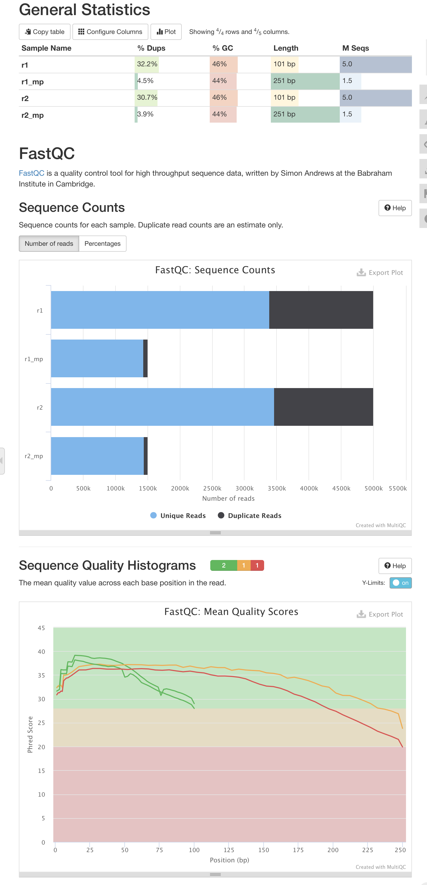
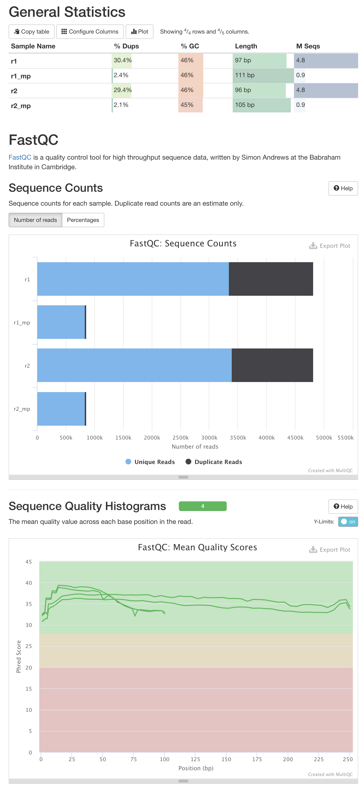

Список команд:

```bash
ln -s /usr/share/data-minor-bioinf/assembly ./assembly

seqtk sample -s 2603 assembly/oil_R1.fastq 5000000 > r1.fastq
seqtk sample -s 2603 assembly/oil_R2.fastq 5000000 > r2.fastq
seqtk sample -s 2603 assembly/oilMP_S4_L001_R1_001.fastq 1500000 > r1_mp.fastq
seqtk sample -s 2603 assembly/oilMP_S4_L001_R2_001.fastq 1500000 > r2_mp.fastq

mkdir fast multi
fastqc -o fast *.fastq
multiqc -o multi fast

platanus_trim r{1,2}.fastq
platanus_internal_trim r*_mp.fastq

mkdir trimmed_fast trimmed_multi
fastqc -o trimmed_fast *trimmed
multiqc -o trimmed_multi trimmed_fast

platanus assemble -f *.trimmed
platanus scaffold -c out_contig.fa -IP1 *.trimmed -OP2 *.int_trimmed
platanus gap_close -c out_scaffold.fa -IP1 *.trimmed -OP2 *.int_trimmed
```

после этого на локальной машине делаем:
```
mkdir data
scp bio:out_contig.fa ./data
scp bio:out_scaffold.fa ./data
scp bio:out_gapClosed.fa ./data/out_scaffold_closed.fa
scp bio:multi/multiqc_report.html ./multiqc.html
scp bio:trimmed_multi/multiqc_report.html ./multiqc_trimmed.html
```

открываем отчеты, смотрим на них:

до подрезания:

после подрезания:


далее идем в жупитер ноутбук и делаем остальную работу там.

